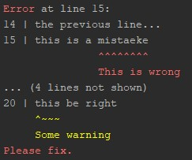
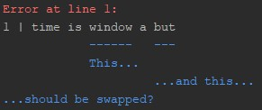
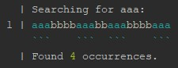

# Pretty Errors!
Small library for highlighting errors in user input, inspired by the Rust compilers' error messages.
Features include support for any color codes (comes with ANSI terminal color codes, which most
terminal emulators and Intellij IDEA support), 'underlining', color ranges, line numbering.
## Examples


```kotlin
prettyPrint(color = true) {
    text("Error at line 15:").color(0..5, ANSI_RED)
    lineNumber(14)
    line("the previous line...")
    line("this is a mistaeke").error(10..18, "This is wrong")
    lineNumber(20)
    line("this be right").warn(0..4, "Some warning")
    text("Please fix.").color(ANSI_RED)
}
```

Use ``prettyFmt`` instead of ``prettyPrint`` if you don't want to write to stdout.



```kotlin
prettyPrint(color = true) {
    text("Error at line 1:").color(ANSI_RED)
    line("time is window a but")
        .underline(8..14, colorPrefix = ANSI_BLUE, hint = "This...")
        .underline(17..20, colorPrefix = ANSI_BLUE, hint = "...and this...")
    text("...should be swapped?").color(ANSI_BLUE)
}
```
Example with **Regex**:  


```kotlin
val str = "aaabbbbaaabbaaabbbbaaa"
val regex = "aaa".toRegex()
prettyPrint(color = true) {
    indentAllLines(true)
    text("Searching for ${regex.pattern}:")
    val theLine = line(str)
    val result = regex.findAll(str)
    result.map { it.range }.forEach {
        val range = it.first .. it.last + 1
        theLine.underline(range, '`', colorPrefix = ANSI_CYAN)
        theLine.color(range, ANSI_CYAN)
    }
    text("Found " concat result.count().toString().pe().color(ANSI_GREEN) concat " occurrences.")
}
```