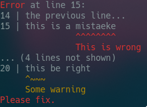

# Prettier Errors!
Small library for highlighting errors in user input, inspired by the Rust compilers' error messages.
Features include support for any color codes (comes with ANSI terminal color codes, which most
terminal emulators and Intellij IDEA support), 'underlining', color ranges, line numbering.
## Examples


(also works in IntelliJ on Windows):


```kotlin
prettyPrint(color = true) {
    text("Error at line 15:").color(0..5, ANSI_RED)
    lineNumber(14) // Change the line number. Will be automatically incremented for following lines.
    line("the previous line...")
    line("this is a mistaeke").error(10..18, "This is wrong") // Highlight the mistake and give a description
    lineNumber(20)
    line("this be right").warn(0..4, "Some warning")
    text("Please fix.").color(ANSI_RED) // Omitting the range will color the whole line
}
```

Use ``prettyFmt`` instead of ``prettyPrint`` if you don't want to write to stdout.

---


```kotlin
prettyPrint(color = true) {
    text("Error at line 1:").color(ANSI_RED)
    line("time is window a but") // Highlight two words:
        .underline(8..14, colorPrefix = ANSI_BLUE, hint = "This...")
        .underline(17..20, colorPrefix = ANSI_BLUE, hint = "...and this...")
    text("...should be swapped?").color(ANSI_BLUE)
}
```

---

Example using Regex match group ranges:  


```kotlin
val str = "aaabbbbaaabbaaabbbbaaa"
val regex = "aaa".toRegex()
prettyPrint(color = true) {
    indentAllLines(true) // Indent information text as well.
    
    text("Searching for ${regex.pattern}:")
    
    val theLine = line(str)
    val result = regex.findAll(str)
    result.map { it.range }.forEach { // For each search result:
        val range = it.first .. it.last + 1
        theLine.underline(range, '`', colorPrefix = ANSI_CYAN)
        theLine.color(range, ANSI_CYAN)
    }
    
    // Instead of specifying color/underline ranges, you can use the infix function
    // 'concat' like so:
    text("Found " concat result.count().toString().pe().color(ANSI_GREEN) concat " occurrences.")
    // This is more intuitive when highlighting words of varying length.
    // Note also the '.pe()': This will convert the string to a 'TextObject',
    // which can have coloring/underlining applied.
}
```

# Quick start
Using gradle: Put ``PrettyErrorsLib-*.jar`` (see ["Artifacts"](https://github.com/hilbigan/PrettyErrors#artifacts)) into your ``libs/`` folder, then add
```
dependencies {
    compile files('libs/PrettyErrorsLib-1.0.jar')
}
```
to your ``build.gradle`` (replace version number accordingly).

# Artifacts
Releases: [Link](https://github.com/hilbigan/PrettyErrors/releases)
